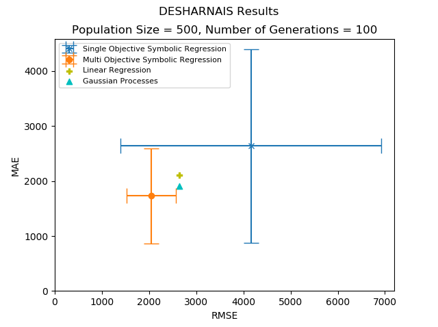

# Genetic Programming

Small python program, uses SOEA & MOEA to generate programs aimed at solving effort-estimation in ARFF files

# Dependencies
  - DEAP
  - matplotlib
  - scipy

# To run
  - run main.py

